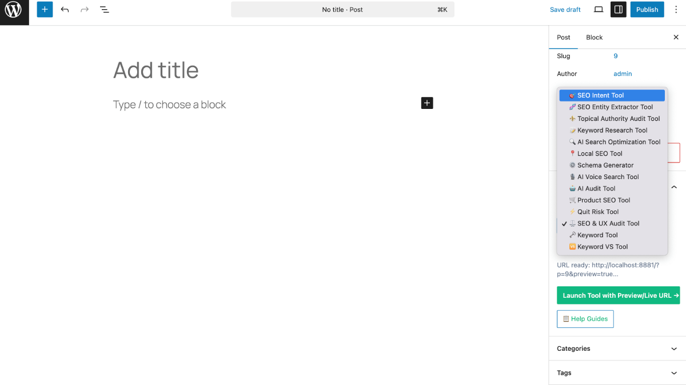
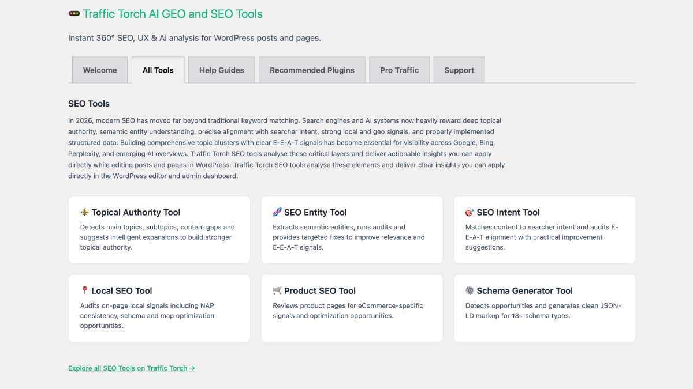
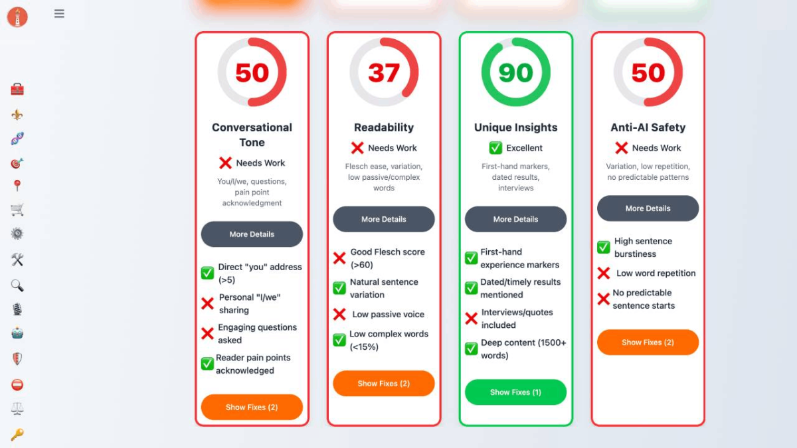
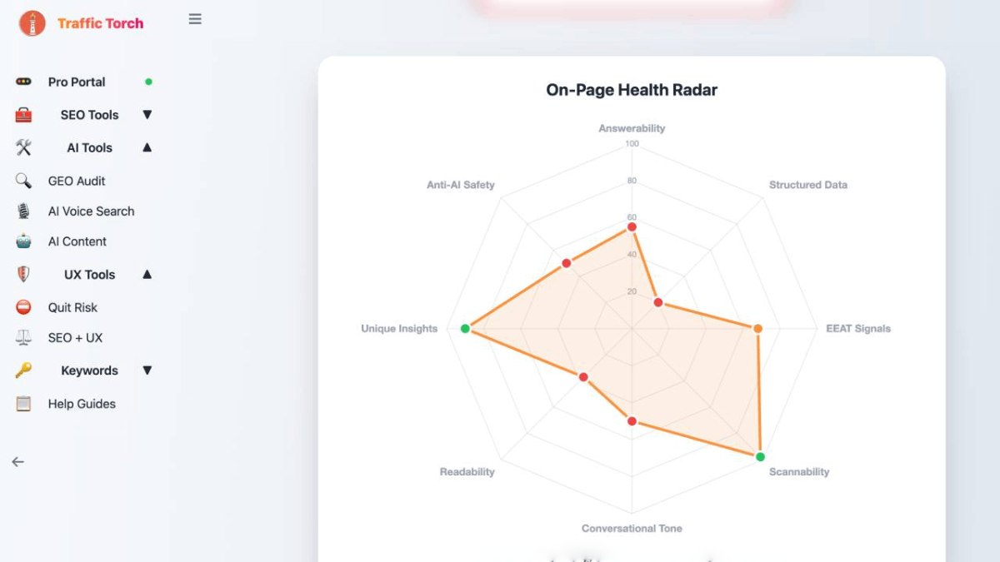

# 🚥 Traffic Torch SEO + GEO + UX Health Analysis Audit Toolkit

**Official GitHub Action** for Traffic Torch.

One-click URL audit that instantly opens the **full interactive Traffic Torch experience** with your URL pre-filled.

Perfect for fast, educational SEO, GEO, AEO and UX Design health checks with deep-dive modules, implementation gap analysis, priority fixes, predictive rank forecasting and best practice education.

### Features
- ✅ One-click audit directly from GitHub Actions.
- ✅ Automatically pre-fills your URL.
- ✅ Full Traffic Torch interface (all deep-dive modules + help guides).
- ✅ Clean job summary with direct link to the report.
- ✅ Mobile-first, fully responsive, and PWA-ready.
- ✅ No API keys or extra setup required.
- ✅ Day/Night mode support.

### How to Use

1. Add the workflow file above as `.github/workflows/traffic-torch-audit.yml`
name: 🚥 Traffic Torch SEO GEO UX Health Analysis Audit

on:
  workflow_dispatch:

jobs:
  audit:
    runs-on: ubuntu-latest
    steps:
      - uses: actions/checkout@v4

      - name: Run Traffic Torch Audit
        uses: traffictorch/traffic-torch-action@v1
        with:
          url: 'your-site.com'   # ← Change this to your URL
          
2. Go to your repository → **Actions** tab  
3. Select **🚥 Traffic Torch SEO GEO UX Health Analysis Audit**  
4. Click **Run workflow**  
5. Enter your URL, select a tool and run  
6. Click the generated link in the job summary → full interactive audit opens in your browser

### Available Tools
⚜️ Topical Authority Audit  
🧬 SEO Entity Extractor  
🎯 SEO Intent Tool  
📍 Local SEO Tool  
🛒 Product SEO Tool  
⚙️ Schema Generator  
🔎 AI Search Optimization  
🎙️ AI Voice Search Tool  
🤖 AI Audit Tool  
⛔ Quit Risk Tool  
⚖️ SEO UX Tool  
🔑 Keyword Research Tool  
🗝️ Keyword Tool  
🆚 Keyword vs Tool  

### Screenshots

### Installation for Any Repo

Works with **any site** — live, staging, preview, or static GitHub Pages / Cloudflare Pages.

---

**Made for Traffic Torch**  
This is the official companion GitHub Action for **Traffic Torch** — your all-in-one SEO, GEO, and UX Health Analysis platform with educational reports and priority fixes.

**Keywords:** Traffic Torch GitHub Action, SEO audit GitHub Action, UX audit action, GEO audit, AI audit tool, Topical Authority Audit, Schema Generator

Made with ❤️ for the Web Dev and Traffic Torch community.